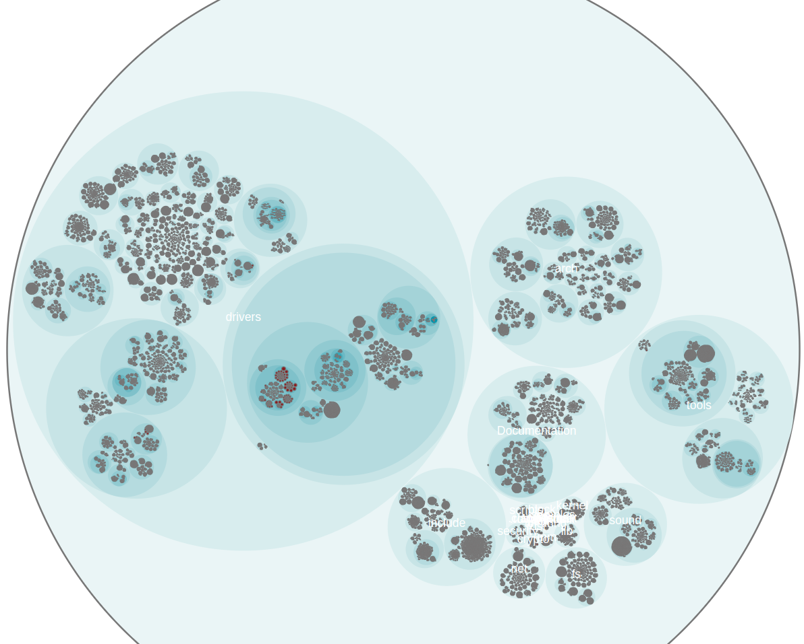

# forensic-code-analysis

forensic code analysis based on "Your code as a crime scene"
<a href="link"></a>

## build hotspot from your project

copy your project nearby docker-compose.yaml or use git to clone it

```
git clone https://github.com/hibernate/hibernate-orm.git
git checkout $(git rev-list -n 1 --before="2013-09-05" main)

```

run below command to make hotspots. this command should create result folder with json html and some csv files

```
docker-compose run --rm -it make-hotspot
```
input project name in commandline

## navigate hotspots
```
docker-compose up  display-hotspot
```
after using this command open your browser and navigate to this url:
```
http://127.0.0.1:8888/hotspot.html
```


# Generate a Version-Control Log 
```
git log --pretty=format:'[%h] %an %ad %s' --date=short \
--numstat --before=2013-09-05 --after=2012-01-01 > hib_evo.log
```
```
maat -l hib_evo.log -c git -a revisions > maat_freqs.csv
cloc ./ --by-file --csv --quiet --report-file=maat_lines.csv
python3 ../maat-scripts/transform/csv_as_enclosure_json.py --structure ./maat_lines.csv --weights maat_fre
qs.csv > output.csv

```


```
docker-compose run --rm -it make_hotspot 
```
```
 python3 -m http.server 8888
```
## check test and production code bandaries 

### First, you must generate the git_evo.log file. This file contains the commit history of your project. You can generate it with a git log command. For example:

use this repo for test  git@github.com:adamtornhill/code-maat.git

```
git log --pretty=format:'[%h] %an %ad %s' --date=short --numstat > git_evo.log
```

This command will output a detailed log of your project's commit history in a format that Code Maat can read.

Next, you need to create a transformation file named maat_src_test_boundaries.txt. This file specifies how Code Maat translates files within physical directories to logical 

names. For example, to analyze the coupling between application code and test code, the file should contain lines like these:

```
src/code_maat => Code
test/code_maat => Test
```

These lines tell Code Maat that everything under the src/code_maat directory should be considered 'Code' and everything under test/code_maat should be considered 'Test'.

Therefore, the necessary steps before executing maat -l git_evo.log -c git -a coupling -g maat_src_test_boundaries.txt are:

1. Generate the git_evo.log file using the git log command with the appropriate formatting options.

2. Create the maat_src_test_boundaries.txt file with the correct mappings of directories to logical names.

3. Ensure that the maat tool is installed and accessible in your command-line environment.

4. Ensure that you are in the top-level directory of your git repository where git_evo.log and maat_src_test_boundaries.txt are located


```
maat -l maat_evo.log -c git -a coupling -g maat_src_test_boundaries.txt
entity,coupled,degree,average-revs
Code,Test,69,181
```

* 69: This is the degree of coupling between the "Code" and "Test" entities. It represents the percentage of commits where both "Code" and "Test" were changed together. In

this specific case, it indicates that in 69% of all commits, a change to the application code (src/code_maat) was accompanied by a change to the test code (test/code_maat).

* 181: This is the average number of revisions for the involved modules. It is calculated as a weighted number of total revisions for the "Code" and "Test" entities. The idea

here is to filter out modules with too few revisions to avoid bias.

## get a summary of individual contributions

```
maat -c git -l hib_evo.log -a entity-effort
```
result is:
```
entity,author,author-revs,total-revs
...
AbstractEntityPersister.java,Steve Ebersole,17,44
AbstractEntityPersister.java,Brett Meyer,3,44
AbstractEntityPersister.java,Rob Worsnop,5,44
...
AbstractEntityPersister.java,Gail Badner,4,44
AbstractEntityPersister.java,Paweł Stawicki,1,44
AbstractEntityPersister.java,Strong Liu,2,44
```
